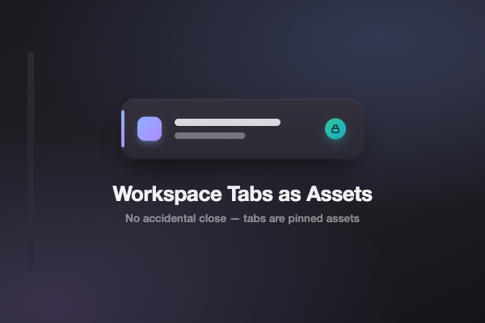

# Workspace Tabs as Assets — a Zen Browser Mod

Tabs in a workspace are **assets**, not disposable tabs. This mod removes the
hover `×` close button so a tab can't be dismissed by an accidental click.

## Scope

Open this mod's preferences to choose how far it reaches:

- **Default** — hides the `×` on **pinned tabs + Essentials** only.
- **"Treat ALL workspace tabs as assets"** — also hides the `×` on normal tabs.

## Closing a tab on purpose

With the `×` gone, close a tab deliberately via **right-click → Close Tab**, or
**middle-click** the tab.

## Optional: also stop cmd+w from closing them

Zen Mods are CSS-only, so this mod **cannot** change what cmd+w does — that
shortcut still closes the focused tab. If you want cmd+w to leave your asset
tabs alone too, disable the "Close Tab" shortcut yourself:

1. **Quit Zen** (it rewrites the file on exit).
2. Edit `zen-keyboard-shortcuts.json` in your profile folder and set
   `"disabled": true` on the entry with `"id": "key_close"`.
3. Relaunch Zen. cmd+w will no longer close any tab (other close methods still
   work). Set it back to `false` to restore.

> Tip: `zen.pinned-tab-manager.close-shortcut-behavior` in `about:config`
> already makes cmd+w *reset/unload* pinned tabs instead of closing them, if you
> only care about pinned tabs and want to keep cmd+w working for normal ones.

## Install

Get it from the [Zen Mods store](https://zen-browser.app/mods), or install
locally by copying `chrome.css`, `readme.md`, and `preferences.json` into a
folder under your profile's `chrome/zen-themes/<uuid>/`.

## License

[CC BY-NC-SA 4.0](./LICENSE) — required by the Zen theme store.
